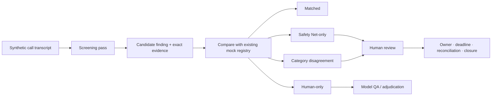

# Safety Net — Patient Call Review Assistant

> Portfolio prototype · synthetic data only · human-in-the-loop by design

Safety Net explores a narrow operational question: **can every available patient-support call be
screened for information that may warrant human pharmacovigilance review, while keeping the final
decision with a person?**

The prototype preserves exact transcript evidence, compares screening findings with a synthetic
mock registry, and keeps unresolved work visible through review, ownership, deadlines,
reconciliation, escalation, and closure.

**[Watch the 3-minute narrated demo](https://github.com/lomendor/safety-net/releases/download/v1.0.0/safety-net-demo.mp4)**

## The workflow

The first screening pass does not see the author-defined registry labels. Comparison happens
afterwards, using the call and screening category. A disagreement is routed for inspection; the
software does not decide which source is correct.

## What the prototype demonstrates

- Systematic screening of the available synthetic transcripts rather than a sample.
- Candidate findings anchored to verbatim excerpts that are checked against the source text.
- Explicit coverage states: matched, Safety Net-only, human-only, category disagreement, and no
  signal from either available source.
- Human confirmation, clarification, routing, escalation, or dismissal with a required rationale.
- Append-only workflow history for review and reconciliation events.
- Frozen prompts, schemas, corpora, and run fingerprints for reproducible comparisons.

## Functional evaluation

The current baseline is deliberately presented as a **functional test on author-created synthetic
data**, not as validation:

| Synthetic check | Recorded result |
|---|---:|
| Author-labelled positives producing a finding | 25/25 |
| Author-labelled negatives without a finding | 25/25 |
| Standard-baseline evidence excerpts matching the source verbatim | 73/73 |
| Difficult missed-signal cases producing a finding | 8/8 |
| Challenge negative controls flagged | 1/4 |
| Challenge acceptance gate | **FAIL** |

The FAIL is preserved. One negative-control label became disputed after the run and requires
independent adjudication; it was not rewritten to improve the score. See [EVALUATION.md](EVALUATION.md).

## What it does not establish

- It does not determine whether an adverse event exists or is reportable.
- It does not replace pharmacovigilance professionals, validated SOPs, or reporting obligations.
- It does not perform validated MedDRA coding, medical assessment, or causality assessment.
- It does not establish real-world sensitivity, specificity, regulatory validity, or production
  performance.
- It has not processed real patient data or real call recordings.

The next meaningful experiment is independent blind review of a small synthetic subset, comparing
the author label, the external judgment, and the Safety Net result without hiding disagreements.

## Repository scope

This repository is a presentation-only showcase. The runnable implementation, prompts, rule banks,
full synthetic corpus, labels, reviewer material, and internal development history are private.
Representative examples are available in [EXAMPLES.md](EXAMPLES.md).

## Ελληνικά — σύντομη περιγραφή

Το Safety Net είναι ένα portfolio prototype για δεύτερο έλεγχο συνθετικών transcripts από
γραμμές υποστήριξης ασθενών. Δεν αποφασίζει αν υπάρχει ανεπιθύμητη ενέργεια. Επισημαίνει πιθανή
πληροφορία μαζί με το ακριβές απόσπασμα και κρατά την εκκρεμότητα ορατή μέχρι ανθρώπινη απόφαση,
ανάθεση, reconciliation και closure.

Τα δημοσιευμένα αποτελέσματα αφορούν αποκλειστικά author-defined synthetic cases. Δεν αποτελούν
κλινική, κανονιστική ή παραγωγική επικύρωση.

## Author and rights

Designed and specified by **Panagiotis Kourkoutis**. Implementation and adversarial review were
AI-assisted. No independent pharmacovigilance validation has been completed.

[LinkedIn](https://www.linkedin.com/in/panagiotis-kourkoutis-09274aa1) ·
[Rights and permitted use](RIGHTS.md) · [Disclaimer](DISCLAIMER.md)
