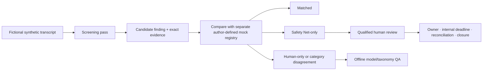
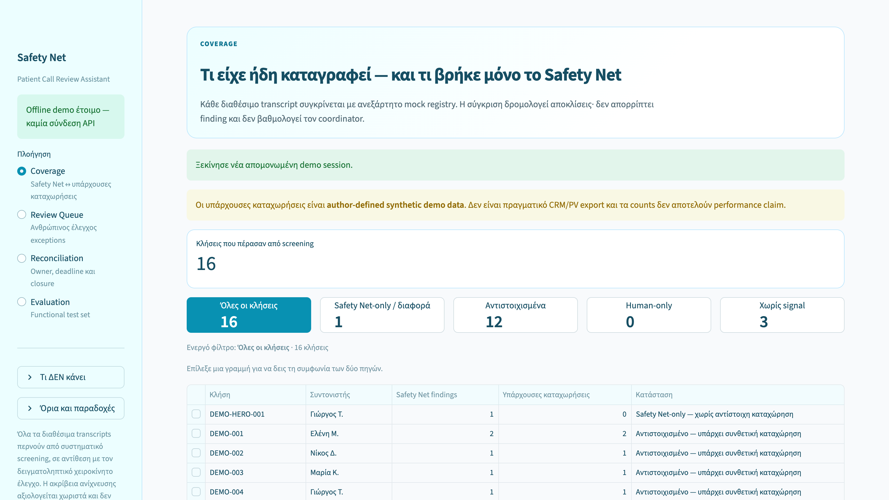
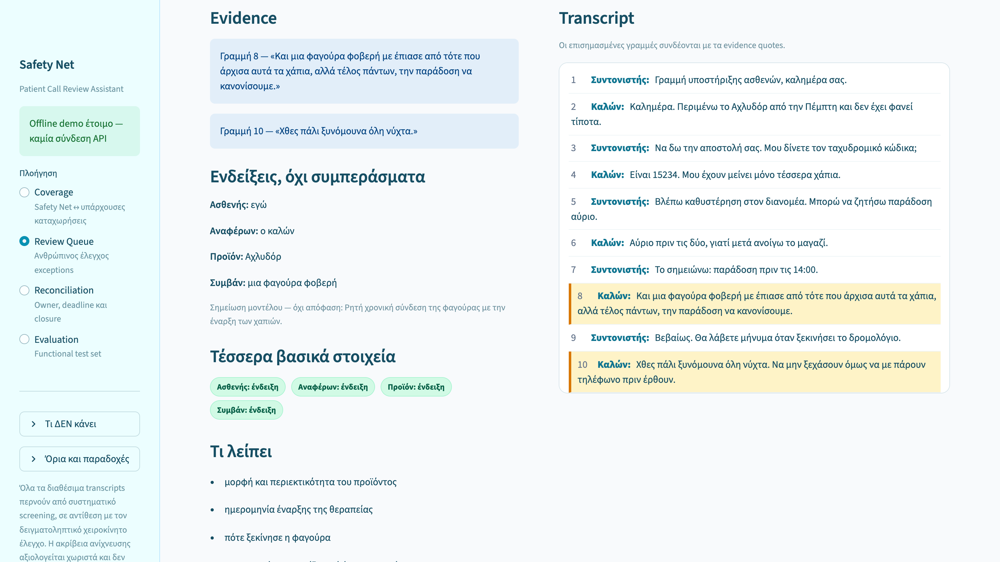
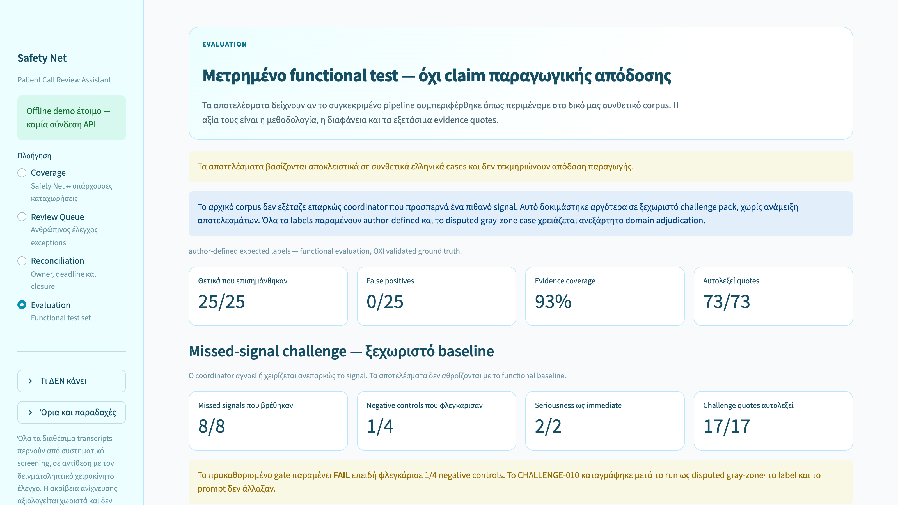

# Safety Net — Patient Call Review Assistant

> Portfolio prototype · fictional synthetic data only · human-in-the-loop by design

Safety Net explores a narrow operational question: **can every transcript in a fixed synthetic
demo set be screened for information that may warrant human pharmacovigilance review, while
keeping the final decision with a qualified person?**

The prototype preserves exact transcript evidence, compares screening findings with a separate,
author-defined synthetic mock registry, and keeps unresolved work visible through review,
ownership, simulated internal deadlines, reconciliation, escalation, and documented closure.

The current private baseline adds a Guided Journey and frozen held-out evidence. The runnable
implementation, evaluation artifacts, and reviewer material remain private; the media below are
unchanged historical v1.0 artifacts.

## Current workflow boundary

The first screening pass does not see the author-defined registry labels. Comparison happens only
after the model output is frozen. Safety Net-only exceptions enter the operational review flow;
Human-only and category-disagreement cases are offline QA evidence by default. The software does
not decide which source is correct.

## Historical v1.0 media

**[Watch the historical v1.0 narrated demo (3:33)](https://github.com/lomendor/safety-net/releases/download/v1.0.0/safety-net-demo.mp4)**

The screenshots below preserve the July 2026 v1.0 interface and are exact files from the historical
source commit dated 19 July 2026. The narrated MP4 was attached to the release on 11 August 2026.
Both predate the Guided Journey and the frozen 10-case held-out evidence; their UI and terminology
remain unchanged for provenance.

The three screenshots and two transcript excerpts reused in this showcase retain their
historical source-tree MIT scope. The release MP4 has a separate, conservatively stated rights
status because it was not stored in that Git tree. See
[Rights and permitted use](RIGHTS.md) and the
[scoped historical MIT notice](HISTORICAL_V1_MIT_NOTICE.md).

The historical Coverage screen uses the phrase “independent mock registry.” Here, that means a
separately prepared, **author-defined synthetic comparison source**. It does not mean independent
ground truth, independent domain review, or pharmacovigilance validation.

*Historical v1.0 · Coverage. The displayed registry is separate author-defined synthetic data.*

*Historical v1.0 · Review evidence from a fictional synthetic transcript.*

*Historical v1.0 · Functional evaluation with author-defined expectations and preserved FAIL.*

## What the prototype demonstrates

- Systematic screening of the fixed synthetic demo set rather than a sampled subset.
- Candidate findings anchored to verbatim excerpts checked against the source transcript.
- Explicit coverage states: matched, Safety Net-only, human-only, category disagreement, and no
  signal from either available synthetic source.
- Human confirmation, clarification, routing, escalation, or dismissal with a required rationale.
- Append-only event controls within the prototype database for review and reconciliation actions.
- Frozen internal artifacts and fingerprints for controlled internal comparisons.

## Functional evaluation

The recorded baseline is deliberately presented as a **functional test on author-created
synthetic data**, not as validation:

| Synthetic check | Recorded result |
|---|---:|
| Author-labelled positives producing a finding | 25/25 |
| Author-labelled negatives without a finding | 25/25 |
| Standard-baseline evidence excerpts matching the source verbatim | 73/73 |
| Difficult missed-signal cases producing a finding | 8/8 |
| Challenge negative controls flagged | 1/4 |
| Challenge acceptance gate | **FAIL** |

The FAIL is preserved. One negative-control label became disputed after the run; it was not
rewritten to improve the score. See [EVALUATION.md](EVALUATION.md).

On 13 August 2026, a new 10-case synthetic reviewer pack and a model-only output were frozen before
independent judgments. No independent judgments, accuracy calculation, or agreement scoring have
been completed. The reviewer pack, labels, and model output are not published here.

## What it does not establish

- It does not determine whether an adverse event exists, is serious, or is reportable.
- It does not establish causality, day zero, or a regulatory deadline.
- It does not replace qualified pharmacovigilance professionals, approved SOPs, validated case
  systems, reporting obligations, or legal requirements.
- It does not perform validated MedDRA coding, medical assessment, or automated reporting.
- It does not establish real-world sensitivity, specificity, accuracy, regulatory validity, or
  production performance.
- It has not processed real patient data or real call recordings.
- Displayed deadlines are simulated internal workflow controls, not regulatory clocks.

The next evidence step is to collect independent judgments on the frozen 10-case reviewer set and
then compare `author label ↔ independent judgment ↔ frozen Safety Net output` without changing any
of the three retrospectively.

## Repository scope

This repository is a presentation-only showcase. The runnable implementation, prompts, rule banks,
full synthetic corpus, labels, reviewer material, model outputs, disagreement analysis, internal
notes, and development history remain private. Three short fictional examples are available in
[EXAMPLES.md](EXAMPLES.md).

## Ελληνικά — σύντομη περιγραφή

Το Safety Net είναι portfolio prototype για δεύτερο έλεγχο ενός παγωμένου συνθετικού demo set.
Δεν αποφασίζει αν υπάρχει ανεπιθύμητη ενέργεια. Επισημαίνει πιθανή πληροφορία μαζί με το ακριβές
απόσπασμα και κρατά την εκκρεμότητα ορατή μέχρι ανθρώπινη απόφαση, ανάθεση, reconciliation και
τεκμηριωμένο closure.

Όλα τα transcripts, labels και registry records είναι πλασματικά και author-defined. Δεν υπάρχουν
πραγματικά δεδομένα ασθενών, ανεξάρτητα επικυρωμένο ground truth ή ολοκληρωμένο ανεξάρτητο domain
validation. Τα αποτελέσματα δείχνουν workflow mechanics σε συνθετικό υλικό — όχι accuracy ή
κλινική, κανονιστική, φαρμακοεπαγρυπνητική ή παραγωγική απόδοση. Οι εμφανιζόμενες προθεσμίες είναι
εσωτερική προσομοίωση και όχι regulatory clocks.

Το video και τα screenshots είναι αμετάβλητα ιστορικά artifacts του v1.0 και προηγούνται του
Guided Journey και του held-out pack. Η παλιά φράση «ανεξάρτητο mock registry» σημαίνει χωριστή,
author-defined συνθετική πηγή σύγκρισης — όχι ανεξάρτητο ground truth ή domain validation.

## Author and rights

Designed and specified by **Panagiotis Kourkoutis**. Implementation and adversarial review were
AI-assisted. No independent pharmacovigilance validation has been completed.

[LinkedIn](https://www.linkedin.com/in/panagiotis-kourkoutis-09274aa1) ·
[Rights and media provenance](RIGHTS.md) ·
[Historical v1 MIT notice](HISTORICAL_V1_MIT_NOTICE.md) ·
[Full disclaimer](DISCLAIMER.md)
